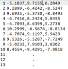

# Kmeans
A k means algorithm implementation using C and Python.
Both implementations comes in order to compare efficiencies between C and Python.

# Implementation
At first iteration the algorithm points the k centroids as the first k vectors from the data,
then assign each vector to the cluster who's centroid is is the closest one.

at the end of the iteration every centoid is calculated as the avarge vector of all vectors assign to that cluster.
continue iterate for a certein amount of Max_Iter variable (200 as default) or all centroids are converged under norm.

# Results
Running time results:
| **#iterations** | **#vectors** | **#clusters** |  **Py (s)**  |  **C (s)**  |
|:---------------:|:------------:|:-------------:|:------------:|:-----------:|
|       1000      |     1000     |       5       |  **_3.245_** | **_0.304_** |
|       1000      |     1000     |       10      |  **_6.943_** |  **_0.54_** |
|       1000      |     2500     |       7       | **_11.822_** | **_0.964_** |
|       1000      |     2500     |       12      | **_20.123_** |  **_1.55_** |
|       1000      |     5000     |       10      | **_35.327_** | **_2.587_** |
|       1000      |     5000     |       15      | **_54.134_** | **_3.875_** |

Clusters Example:

# How to use
1) first about the data format: your data file should be list of vectors of the same dimension, written to a .txt file
   for exempla:
   
   
 
